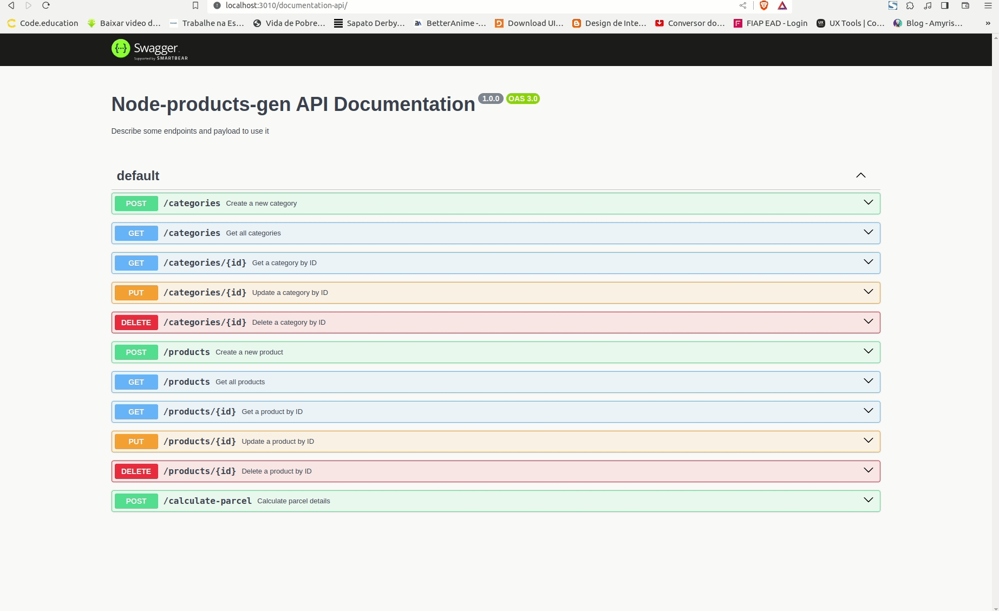
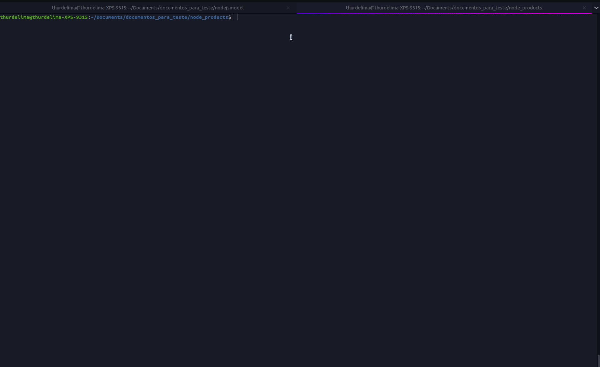
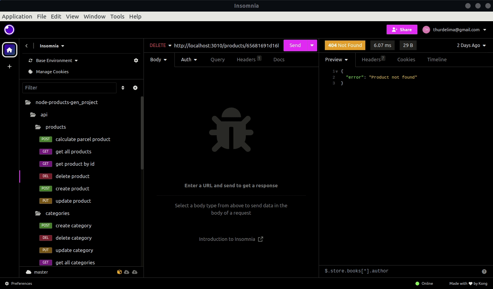

# 🧸 Node-products-gen

Node project based gen test.

## 💡 Docs:

Access http://localhost:3010/documentation-api to view descriptions of endpoints.

<div align="center" >
  
</div>

## 🧪 Tests:

To run tests, just type npm run test.

```bash
  npm run test
```

<div align="center" >
  
</div>

## 🐋 Container

Just docker-compose up, to up container project. Case you want run local, just npm run dev.

```bash
  docker-compose up
```
```bash
  npm run dev
```

<div align="center" >
  
</div>

## 🧳 Collections

Just import file node-products-gen_collections.json in your insomnia or postman to make requests.

<div align="center" >
  
</div>

<br/>

<h4 align="center">

Made with ♥ by Arthur Lima :wave: [Get in touch!](https://www.linkedin.com/in/arthur-lima-294ab0103/)

</h4>
